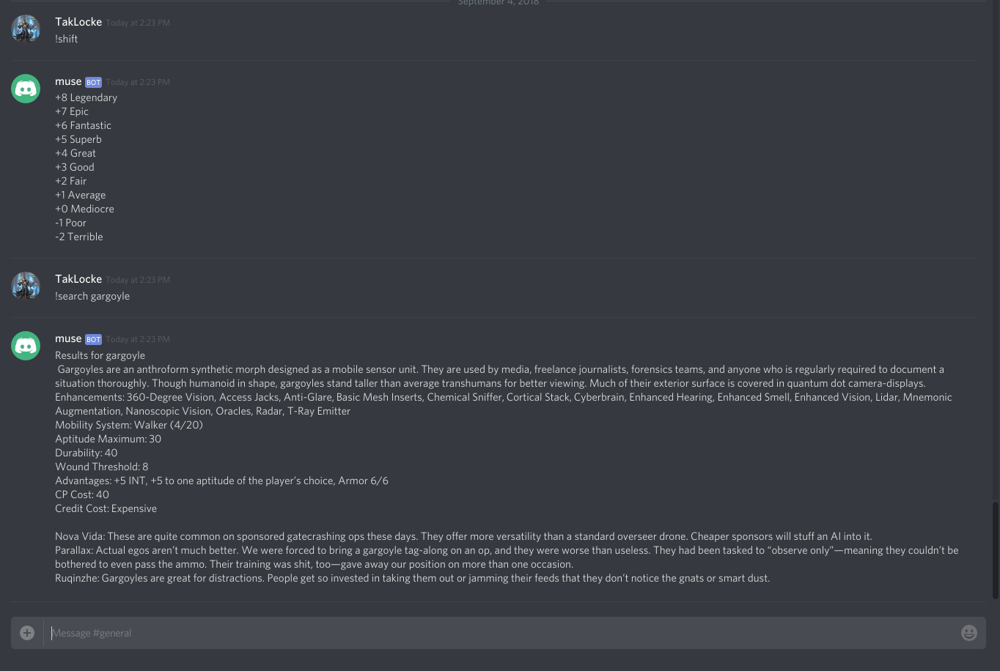

# Doppler

This is a project inspired by Chucks Eclipse Phase wiki and the muses from the Eclipse Phase setting. 

The goal is to create a dataset that can be accessed via bots (this project provides an interface for use with discord, but could be slack, IRC, etc) allowing players and game masters to find setting information quickly to enhance their game play.

Today the bot comes with a dataset for Eclipse Phase and some utility functions for FATE. For functionality that is on the roadmap please checkout the Github issues for Doppler. If you think there is functionality missing that would be helpful feel free to open up a new issue.



## Using Doppler

You can use Doppler by cloning the project, adding your Discord token to main.py and running:

```
cd Doppler
pip install -r requirements.txt
python3.6 main.py
```

To see the command available via Doppler add the bot to your server and call:

`!muse_help`

## Attribution
Posthuman Studios, LLC. [Eclipse Phase](http://eclipsephase.com)

Fate Core System and Fate Accelerated Edition, products of [Evil Hat Productions](https://www.evilhat.com/home/), LLC, developed, authored, and edited by Leonard Balsera, Brian Engard, Jeremy Keller, Ryan Macklin, Mike Olson, Clark Valentine, Amanda Valentine, Fred Hicks, and Rob Donoghue, and licensed for our use under the Creative Commons Attribution 3.0 Unported license.

## FAQ

How do I get a Discord token:
https://discordapp.com/developers/applications/
https://discordapp.com/developers/docs/intro

How do I add a Discord bot to my channel:
https://discordpy.readthedocs.io/en/rewrite/discord.html

What is a Discord bot:
https://discordapp.com/developers/docs/topics/oauth2#bots
